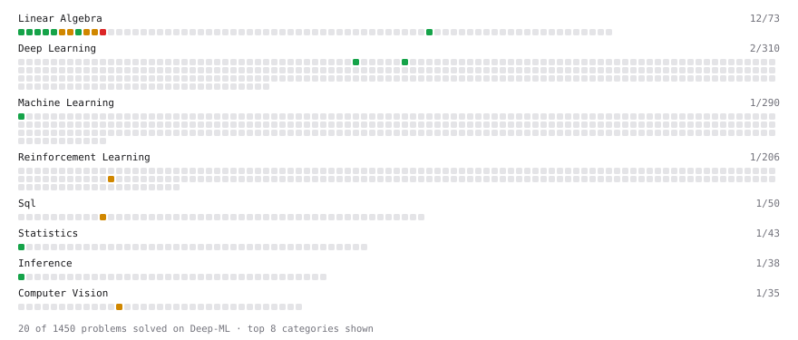

# Deep-ML

My machine learning practice from [Deep-ML](https://www.deep-ml.com). Every solution here was written by hand.

**21** solved · 20 problems · 1 labs · 0 math

[**Browse the interactive portfolio**](https://gouthamk16.github.io/deep-ml/) to replay this filling in over time.

## Problems

| | Difficulty | Solved | |
| --- | --- | --- | --- |
| [Calculate 2x2 Matrix Inverse](https://www.deep-ml.com/problems/8) | easy | 2026-07-02 | [solution](problems/0008-calculate-2x2-matrix-inverse) |
| [Calculate Covariance Matrix](https://www.deep-ml.com/problems/10) | easy | 2026-07-04 | [solution](problems/0010-calculate-covariance-matrix) |
| [Calculate Mean by Row or Column](https://www.deep-ml.com/problems/4) | easy | 2026-07-02 | [solution](problems/0004-calculate-mean-by-row-or-column) |
| [Compute Arithmetic Intensity and Classify Bottleneck](https://www.deep-ml.com/problems/414) | easy | 2026-07-09 | [solution](problems/0414-compute-arithmetic-intensity-and-classify-bottleneck) |
| [Implement SwiGLU activation function](https://www.deep-ml.com/problems/156) | easy | 2026-07-08 | [solution](problems/0156-implement-swiglu-activation-function) |
| [L2 Normalization Along an Axis](https://www.deep-ml.com/problems/1022) | easy | 2026-07-07 | [solution](problems/1022-l2-normalization-along-an-axis) |
| [Linear Regression Using Normal Equation](https://www.deep-ml.com/problems/14) | easy | 2026-07-05 | [solution](problems/0014-linear-regression-using-normal-equation) |
| [Matrix-Vector Dot Product](https://www.deep-ml.com/problems/1) | easy | 2026-07-02 | [solution](problems/0001-matrix-vector-dot-product) |
| [Momentum Optimizer](https://www.deep-ml.com/problems/146) | easy | 2026-07-05 | [solution](problems/0146-momentum-optimizer) |
| [Reshape Matrix](https://www.deep-ml.com/problems/3) | easy | 2026-07-02 | [solution](problems/0003-reshape-matrix) |
| [Scalar Multiplication of a Matrix](https://www.deep-ml.com/problems/5) | easy | 2026-07-02 | [solution](problems/0005-scalar-multiplication-of-a-matrix) |
| [Transpose of a Matrix](https://www.deep-ml.com/problems/2) | easy | 2026-07-02 | [solution](problems/0002-transpose-of-a-matrix) |
| [Calculate Eigenvalues of a Matrix](https://www.deep-ml.com/problems/6) | medium | 2026-07-02 | [solution](problems/0006-calculate-eigenvalues-of-a-matrix) |
| [Expected vs Sample Updates Comparison](https://www.deep-ml.com/problems/566) | medium | 2026-07-07 | [solution](problems/0566-expected-vs-sample-updates-comparison) |
| [Frame-Aware Corrupt for Drift Simulation](https://www.deep-ml.com/problems/459) | medium | 2026-09-28 | [solution](problems/0459-frame-aware-corrupt-for-drift-simulation) |
| [Matrix times Matrix ](https://www.deep-ml.com/problems/9) | medium | 2026-07-02 | [solution](problems/0009-matrix-times-matrix) |
| [Matrix Transformation ](https://www.deep-ml.com/problems/7) | medium | 2026-07-02 | [solution](problems/0007-matrix-transformation) |
| [Solve Linear Equations using Jacobi Method](https://www.deep-ml.com/problems/11) | medium | 2026-07-04 | [solution](problems/0011-solve-linear-equations-using-jacobi-method) |
| [Top-3 Salaries Per Department](https://www.deep-ml.com/problems/1111) | medium | 2026-07-09 | [solution](problems/1111-top-3-salaries-per-department) |
| [Singular Value Decomposition (SVD) of 2x2 Matrix](https://www.deep-ml.com/problems/12) | hard | 2026-07-05 | [solution](problems/0012-singular-value-decomposition-svd-of-2x2-matrix) |

## Labs

| | Difficulty | Solved | |
| --- | --- | --- | --- |
| [Design Your Own Normalization Layer](https://www.deep-ml.com/labs/24) | easy | 2026-09-28 | [solution](labs/0024-design-your-own-normalization-layer) |

---

_This file is regenerated by Deep-ML on every push._
